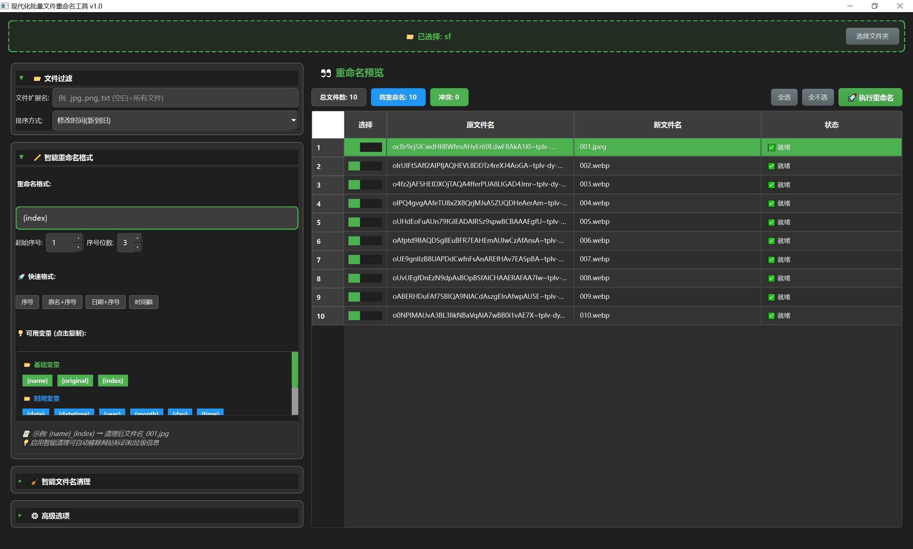

# FishRemef - 现代化批量文件重命名工具

## 🚀 如何运行

1.  **安装 Python (所有用户必备)**
    本项目需要 Python 3.8+ 环境。请先确保已正确安装并配置好环境变量。
    -   如果未安装，请从 [Python 官网](https://www.python.org/downloads/) 下载。

2.  **启动程序**
    -   **Windows 用户 (推荐)**: 
        直接双击 `run.bat` 文件。脚本会自动安装依赖并启动程序。

    -   **手动启动 (适用于所有系统)**:
        打开终端或命令提示符，执行以下命令：
        ```bash
        # 1. 安装依赖
        pip install PySide6 -i https://pypi.tuna.tsinghua.edu.cn/simple

        # 2. 运行程序
        python main.py
        ```

## 🛠️ 如何使用

1.  **选择文件夹**: 拖拽文件夹到程序窗口或点击按钮选择。
2.  **设置规则**: 在左侧面板设置过滤、排序和重命名格式。
3.  **预览效果**: 在右侧表格查看新文件名预览。
4.  **开始重命名**: 点击右上角执行重命名按钮执行操作。

## ✨ 主要功能

- 支持拖拽操作和实时预览
- 可自定义重命名格式，支持序号、日期等多种变量
- 内置智能文件名清理规则
- 支持按文件类型过滤和多种排序方式
- 操作前可选择创建文件备份

## 🖥️ 软件截图


